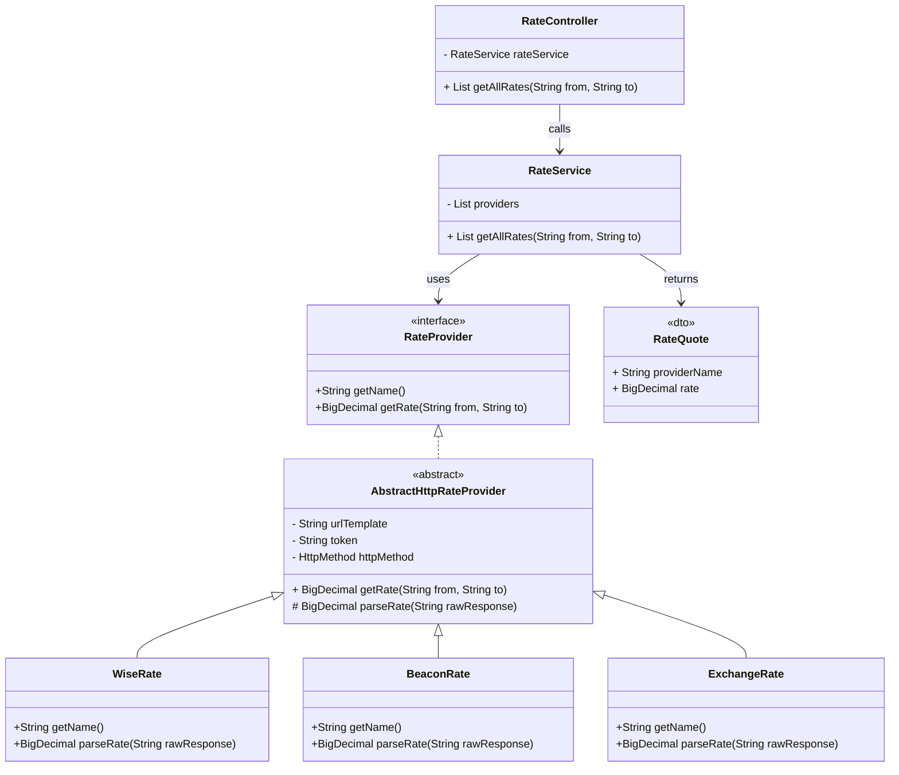

# centralized-rates
Exel's Personal Project on Money Changers, to get the latest Rates from Money Changers 

### Class Diagram 

```mermaid
classDiagram
    
    class RateProvider {
        <<interface>>
        +String getName()
        +BigDecimal getRate(String from, String to)
    }

    %% Abstract base
    class AbstractHttpRateProvider {
        <<abstract>>
        - String urlTemplate
        - String token
        - HttpMethod httpMethod
        + BigDecimal getRate(String from, String to)
        # BigDecimal parseRate(String rawResponse)
    }

    %% Concrete providers
    class WiseRate {
        +String getName()
        +BigDecimal parseRate(String rawResponse)
    }
    class BeaconRate {
        +String getName()
        +BigDecimal parseRate(String rawResponse)
    }
    class ExchangeRate {
        +String getName()
        +BigDecimal parseRate(String rawResponse)
    }

    %% Service & DTO
    class RateService {
        - List<RateProvider> providers
        + List<RateQuote> getAllRates(String from, String to)
    }
    class RateQuote {
        <<dto>>
        + String providerName
        + BigDecimal rate
    }

    %% Controller
    class RateController {
        - RateService rateService
        + List<RateQuote> getAllRates(String from, String to)
    }

    %% Relationships
    RateProvider <|.. AbstractHttpRateProvider
    AbstractHttpRateProvider <|-- WiseRate
    AbstractHttpRateProvider <|-- BeaconRate
    AbstractHttpRateProvider <|-- ExchangeRate

    RateService --> RateProvider : uses
    RateService --> RateQuote : returns
    RateController --> RateService : calls


```